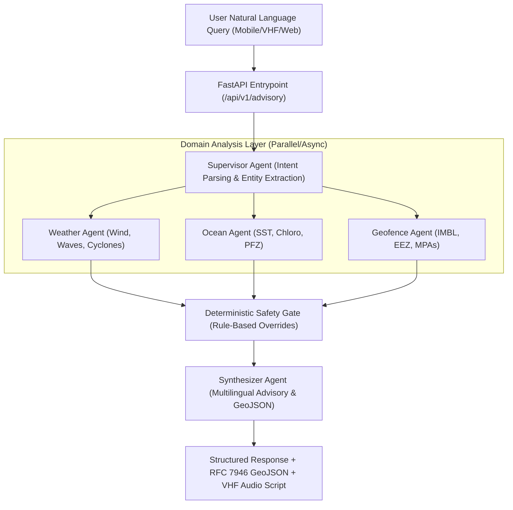

# Agentic Marine Intelligence Platform - Decision-Support Engine (Role 1)

This repository contains the backend decision-support engine for the **Agentic Marine Intelligence Platform**, built according to `ROLE_1_SPEC.md`.

---

## 📖 Table of Contents
1. [System Architecture](#system-architecture)
2. [Detailed File Index & Documentation](#detailed-file-index--documentation)
   - [Configuration & Schemas](#1-configuration--schemas)
   - [Domain Tools](#2-domain-tools)
   - [Agent Suite](#3-agent-suite)
   - [Graph Orchestration & API](#4-graph-orchestration--api)
   - [Automated Tests](#5-automated-tests)
3. [Safety Overrides & Deterministic Rules](#safety-overrides--deterministic-rules)
4. [Multilingual Support](#multilingual-support)
5. [API Reference](#api-reference)
6. [Running the Application & Tests](#running-the-application--tests)

---

## 🏗️ System Architecture



---

## 📂 Detailed File Index & Documentation

### 1. Configuration & Schemas

#### [`backend/app/config.py`](file:///c:/Users/ANSH%20CHAMADIA/Desktop/sih%202026/backend/app/config.py)
* **Purpose**: Centralized application configuration using `pydantic-settings`.
* **Key Components**:
  * `Settings`: Reads `.env` and environment variables.
  * `IMBL_CRITICAL_BUFFER_NM`: Default critical proximity threshold (default: `3.0` NM).
  * `IMBL_WARNING_BUFFER_NM`: Caution threshold (default: `7.0` NM).
  * `MAX_SAFE_WAVE_HEIGHT_M`: Maximum permissible wave height (default: `3.5` meters).
  * `MAX_SAFE_WIND_SPEED_KNOTS`: Maximum permissible wind speed (default: `28.0` knots).
  * `CORS_ORIGINS`: Cross-Origin Resource Sharing whitelist validator.

#### [`backend/app/schemas.py`](file:///c:/Users/ANSH%20CHAMADIA/Desktop/sih%202026/backend/app/schemas.py)
* **Purpose**: Pydantic v2 data models for input validation, API request/response payloads, and GeoJSON structures.
* **Key Models**:
  * `LanguageEnum`: ISO language codes (`en`, `hi`, `ta`, `te`, `ml`, `bn`, `gu`, `mr`, `or`).
  * `VesselType`: `traditional_catamaran`, `motorized_canoe`, `mechanized_trawler`, `deep_sea_longliner`, `coast_guard_patrol`.
  * `Coordinates`: Latitude, longitude, timestamp, accuracy.
  * `VesselContext`: Vessel physical parameters (length, engine horsepower, fuel range, max safe wave/wind limits).
  * `WeatherAssessment`: Wind speed/direction, wave height, swell period, WMO sea state (0–9), cyclonic risk score ($0.0 - 1.0$).
  * `OceanAssessment`: Sea Surface Temperature (SST), Chlorophyll-a concentration, salinity, current velocity/direction, PFZ detection boolean and confidence.
  * `GeofenceAssessment`: Distance to nearest IMBL, EEZ boundary flag, Marine Protected Area (MPA) check, alert level (`SAFE`, `WARNING`, `CRITICAL_PROXIMITY`, `BREACH`).
  * `SafetyStatus`: `is_safe_to_sail`, `override_triggered`, `override_reasons`, `alert_level` (`GREEN`, `YELLOW`, `ORANGE`, `RED`), `enforcement_action`.
  * `GeoJSONFeature` & `GeoJSONFeatureCollection`: Standardized RFC 7946 spatial objects.
  * `MarineQueryRequest`: Request payload containing query, coordinates, vessel context, language, and target species.
  * `MarineAdvisoryResponse`: Complete synthesized response structure.

#### [`backend/app/state.py`](file:///c:/Users/ANSH%20CHAMADIA/Desktop/sih%202026/backend/app/state.py)
* **Purpose**: TypedDict state specification (`MarineAgentState`) passed between graph nodes.
* **State Keys**: `query`, `coordinates`, `vessel_context`, `language`, `target_species`, `parsed_intent`, `weather_data`, `ocean_data`, `geofence_data`, `safety_eval`, `advisory_title`, `advisory_body`, `audio_broadcast_script`, `spatial_features`, `audit_trail`, `errors`.

---

### 2. Domain Tools

#### [`backend/app/tools/weather_tools.py`](file:///c:/Users/ANSH%20CHAMADIA/Desktop/sih%202026/backend/app/tools/weather_tools.py)
* **Purpose**: Real-time marine meteorology data acquisition with physical continuous simulation fallback.
* **Functions**:
  * `fetch_marine_weather(lat, lon)`: Asynchronously calls Open-Meteo Marine API with fallback to deterministic spatial physics simulation.
  * `_sea_state_from_wave_height(wave_height_m)`: Maps wave height to WMO Code Table 3700 (0: Calm glassy to 8: Phenomenal).
  * `_compute_cyclonic_risk(pressure_hpa, wind_speed_knots, precip_mm)`: Computes normalized cyclonic/depression risk metric.
  * `simulate_indian_waters_weather(lat, lon)`: Deterministic continuous physical modeling of wind, waves, atmospheric pressure, and precipitation calibrated for the Arabian Sea & Bay of Bengal.

#### [`backend/app/tools/ocean_tools.py`](file:///c:/Users/ANSH%20CHAMADIA/Desktop/sih%202026/backend/app/tools/ocean_tools.py)
* **Purpose**: Oceanographic biological productivity and Potential Fishing Zone (PFZ) estimation.
* **Functions**:
  * `fetch_oceanographic_data(lat, lon, target_species)`: Calculates SST ($26.5^\circ\text{C} - 30.5^\circ\text{C}$), Chlorophyll-a ($0.12 - 2.8\text{ mg/m}^3$), surface currents, and salinity.
  * Evaluates thermal fronts ($\Delta\text{SST} \ge 0.5^\circ\text{C}$) and coastal upwelling.
  * `_evaluate_species_suitability(...)`: Recommends high-probability species (Yellowfin Tuna, Indian Mackerel, Oil Sardines, King Seer Fish, Tiger Prawns).
  * Generates PFZ polygon bounding boxes for spatial mapping.

#### [`backend/app/tools/geofence_tools.py`](file:///c:/Users/ANSH%20CHAMADIA/Desktop/sih%202026/backend/app/tools/geofence_tools.py)
* **Purpose**: High-precision maritime boundaries, IMBL detection, and MPA spatial safety checks.
* **Geometries Included**:
  * **India - Sri Lanka IMBL**: Palk Strait, Kachchatheevu sector, and Gulf of Mannar line segments (1974 & 1976 bilateral agreements).
  * **India - Pakistan IMBL**: Sir Creek and Arabian Sea offshore maritime border.
  * **India - Bangladesh IMBL**: Bay of Bengal 2014 ITLOS/PCA award boundary.
  * **Marine Protected Areas (MPAs)**:
    * Gulf of Mannar Marine National Park (No-trawl ecological coral reef zone).
    * Sundarbans Biosphere & Marine Reserve.
    * Gahirmatha Marine Sanctuary (Olive Ridley turtle mass nesting sanctuary).
* **Algorithms**:
  * Geodesic great-circle Haversine distance in Nautical Miles ($1\text{ NM} = 1.852\text{ km}$).
  * Segmented point-to-LineString minimum geodesic distance.
  * Ray-casting point-in-polygon containment testing.
  * Automatic boundary layer styling for MapLibre/Leaflet rendering.

---

### 3. Agent Suite

#### [`backend/app/agents/supervisor.py`](file:///c:/Users/ANSH%20CHAMADIA/Desktop/sih%202026/backend/app/agents/supervisor.py)
* **Purpose**: Supervisor Agent and intent classifier.
* **Functionality**:
  * Classifies queries into `FISHING_ZONE_OPTIMIZATION`, `METEOROLOGICAL_SAFETY`, `BORDER_SECURITY_AND_GEOFENCE`, `EMERGENCY_MARITIME_ALERT`, or `GENERAL_MARINE_ADVISORY`.
  * Extracts target species keywords (Tuna, Sardine, Mackerel, Prawns, Seer Fish, etc.).
  * Dispatches execution routes to domain agents and logs audit trail.

#### [`backend/app/agents/domain_agents.py`](file:///c:/Users/ANSH%20CHAMADIA/Desktop/sih%202026/backend/app/agents/domain_agents.py)
* **Nodes**:
  * `weather_agent_node`: Analyzes wind and sea states against vessel safety limits (e.g. Traditional Catamaran safe wave $< 1.5\text{m}$, Mechanized Trawler $< 3.0\text{m}$).
  * `ocean_agent_node`: Evaluates SST thermal fronts, upwelling, and biological productivity.
  * `geofence_agent_node`: Evaluates spatial proximity to international boundary lines and protected zones.

#### [`backend/app/agents/synthesizer.py`](file:///c:/Users/ANSH%20CHAMADIA/Desktop/sih%202026/backend/app/agents/synthesizer.py)
* **Nodes**:
  * `safety_evaluator_node`: Hard deterministic safety override gate. Evaluates hazard conditions and enforces `RED` / `ORANGE` / `YELLOW` / `GREEN` safety ratings.
  * `synthesizer_node`: Generates localized advisory titles, bodies, VHF audio broadcast scripts, optimal vessel heading recommendations, and compiles the GeoJSON `FeatureCollection`.

---

### 4. Graph Orchestration & API

#### [`backend/app/graph.py`](file:///c:/Users/ANSH%20CHAMADIA/Desktop/sih%202026/backend/app/graph.py)
* **Purpose**: Multi-agent workflow compiler.
* **Details**: Builds a LangGraph `StateGraph` linking `supervisor -> weather_agent -> ocean_agent -> geofence_agent -> safety_evaluator -> synthesizer -> END` with direct asynchronous execution fallbacks.

#### [`backend/app/main.py`](file:///c:/Users/ANSH%20CHAMADIA/Desktop/sih%202026/backend/app/main.py)
* **Purpose**: FastAPI REST service entrypoint.
* **Endpoints**:
  * `GET /`: Platform metadata and discovery.
  * `GET /health` and `GET /api/v1/health`: System health probe.
  * `POST /api/v1/advisory`: Main multi-agent decision support pipeline.
  * `POST /api/v1/geofence/check`: Direct spatial geofence & IMBL probe.
  * `POST /api/v1/weather/check`: Direct marine weather query.
  * `POST /api/v1/ocean/pfz`: Direct PFZ and oceanographic analysis.

---

### 5. Automated Tests

#### [`backend/tests/test_engine.py`](file:///c:/Users/ANSH%20CHAMADIA/Desktop/sih%202026/backend/tests/test_engine.py)
* **Test Cases**:
  1. `test_geofence_imbl_proximity_detection`: Verifies Palk Strait IMBL proximity calculation and warning level.
  2. `test_weather_and_ocean_tools`: Validates wind, wave, SST, and chlorophyll computations.
  3. `test_supervisor_intent_parser`: Verifies intent classification and target species extraction.
  4. `test_deterministic_safety_override_high_wave`: Verifies that severe wave heights trigger mandatory RED safety overrides.
  5. `test_end_to_end_decision_pipeline_multilingual_tamil`: Verifies end-to-end execution with Tamil advisory generation.

#### [`backend/tests/test_api.py`](file:///c:/Users/ANSH%20CHAMADIA/Desktop/sih%202026/backend/tests/test_api.py)
* **Test Cases**:
  1. `test_health_check_endpoint`: Tests `/health` probe.
  2. `test_direct_geofence_check_endpoint`: Tests direct `/api/v1/geofence/check`.
  3. `test_direct_weather_check_endpoint`: Tests `/api/v1/weather/check`.
  4. `test_direct_pfz_check_endpoint`: Tests `/api/v1/ocean/pfz`.
  5. `test_full_advisory_pipeline_endpoint`: Tests end-to-end `POST /api/v1/advisory`.

---

## 🛡️ Safety Overrides & Deterministic Rules

The platform implements a **Hard Deterministic Safety Gate** where safety unconditionally overrides economic incentives:

| Condition | Threshold | Action Triggered | Alert Level |
| :--- | :--- | :--- | :--- |
| **IMBL Proximity** | $\text{Distance} \le 3.0\text{ NM}$ | Immediate course reversal / inshore steer | **RED** |
| **IMBL Caution** | $3.0\text{ NM} < \text{Distance} \le 7.0\text{ NM}$ | Proximity alert & radio watch | **YELLOW** |
| **MPA Encroachment** | Inside protected polygon | Cease bottom trawling / exit zone | **ORANGE / RED** |
| **High Waves** | $\text{Wave Height} > 3.5\text{ m}$ (or vessel limit) | Return to port / seek shelter | **RED** |
| **Gale Winds** | $\text{Wind Speed} \ge 28.0\text{ knots}$ | Return to port / seek shelter | **RED** |
| **Cyclonic Depression** | $\text{Risk Score} \ge 0.60$ | Cease operations & return to harbor | **RED** |

> **Veto Rule**: When a `RED` alert is active, all PFZ recommendations are suppressed, and the synthesized response focuses entirely on life-saving navigational directives.

---

## 🗣️ Multilingual Support

The synthesizer generates native-script advisories and VHF radio transcripts in:
- **English (`en`)**
- **Tamil (`ta`)** (தமிழ்)
- **Hindi (`hi`)** (हिन्दी)
- **Malayalam (`ml`)** (മലയാളം)
- **Telugu (`te`)** (తెలుగు)
- **Bengali (`bn`)**, **Gujarati (`gu`)**, **Marathi (`mr`)**, **Odia (`or`)**

---

## 🚀 Running the Application & Tests

### Install Dependencies
```bash
pip install -r backend/requirements.txt
```

### Run Tests
```bash
pytest backend/tests -v
```

### Start the Server
```bash
python -m uvicorn app.main:app --app-dir backend --host 0.0.0.0 --port 8000 --reload
```
Interactive Swagger Documentation: `http://localhost:8000/docs`
